<style>
blockquote {
  background: #ffedcc;
  border-left: 20px solid #d1bf9d;
  margin: 1.5em 10px;
  padding: 0.5em 10px;
}

section.lead h1 {
  text-align: center;
}
</style>


# Applying engineering principles to reporting

Guillaume (**G**) Belrose

--- 
<!-- paginate: true -->
<!-- header:  -->
<!-- footer: Applying engineering principles to reporting -->

# Data Pipelines: What | How

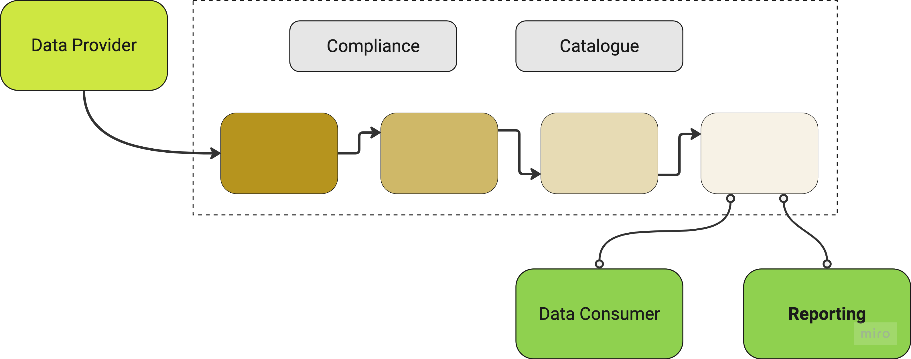

---

# Reporting 101

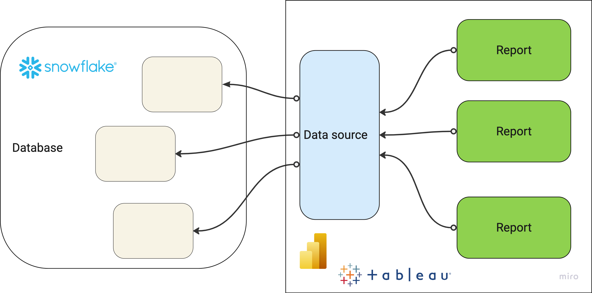

---

# Agenda

## Discovery, extend right & shift left

---

# Discovery

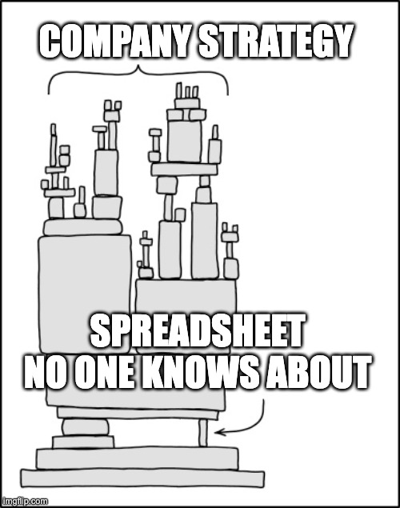

---

# Tableau lineage 

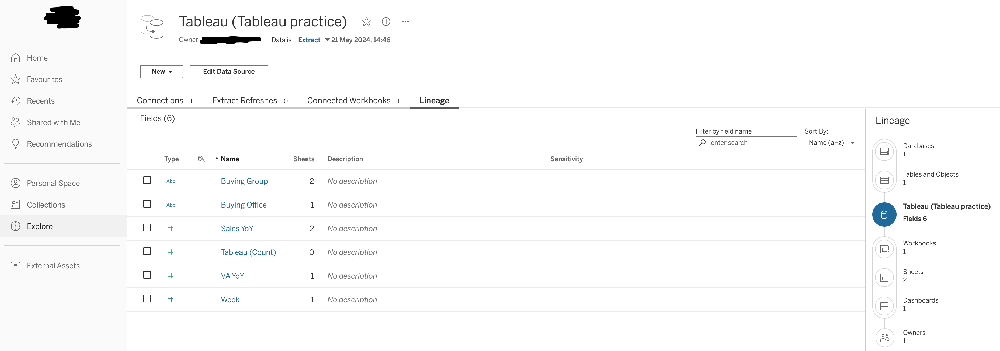

---

# Tableau lineage on steroids

```javascript
query DatasourceDetails($projectName: String!){
  publishedDatasources(filter:{projectName: $projectName}){
    luid
    name
    downstreamWorkbooks{
      luid
      name
    }
  }
}
```

#### See: [Tableau Metadata API](https://help.tableau.com/current/api/metadata_api/en-us/index.html), [GraphQL](https://graphql.org/)

---

# Just enough Python :snake:

```Python
with tableau_server.auth.sign_in(tableau_auth):
    variables = {"projectName": os.environ.get('PROJECT_NAME')}
    query = open('resources/graphql/simple_lineage.graphql').read()

    ## This is the important bit below
    query_results = tableau_server.metadata.query(query, variables=variables)
    with open('simple_lineage.json', 'w') as f:
        json.dump(query_results, f)
```

#### See: [Tableau Server Python Client](https://github.com/tableau/server-client-python)

---

# (Meta)Data Engineering

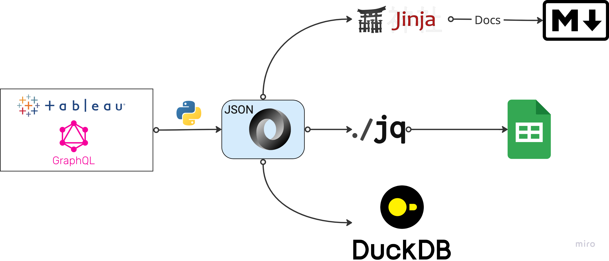

---

# Jinja template :ninja:

```mermaid
flowchart LR

    {{ ds.luid }}({{ ds.name }})
    
      
          {{ wb.luid }}["{{  wb.name }}"]
          {{ ds.luid }} --> {{ wb.luid }}
      
    

```

#### See: [Jinja](https://jinja.palletsprojects.com/en/3.1.x/), [MermaidJS flowcharts](https://mermaid.js.org/syntax/flowchart.html)

---

# The little mermaid :mermaid:

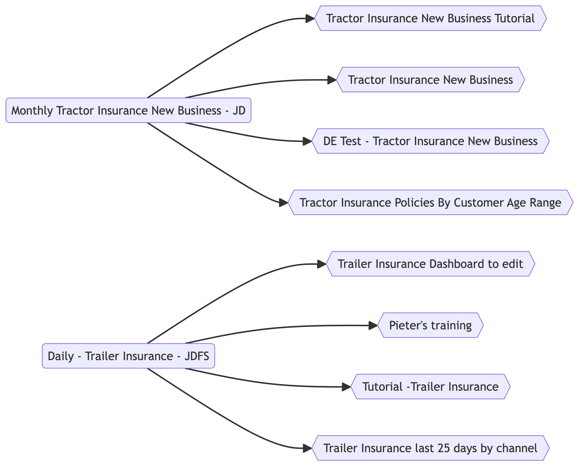

---

# Extend right: data pipelines with dbt

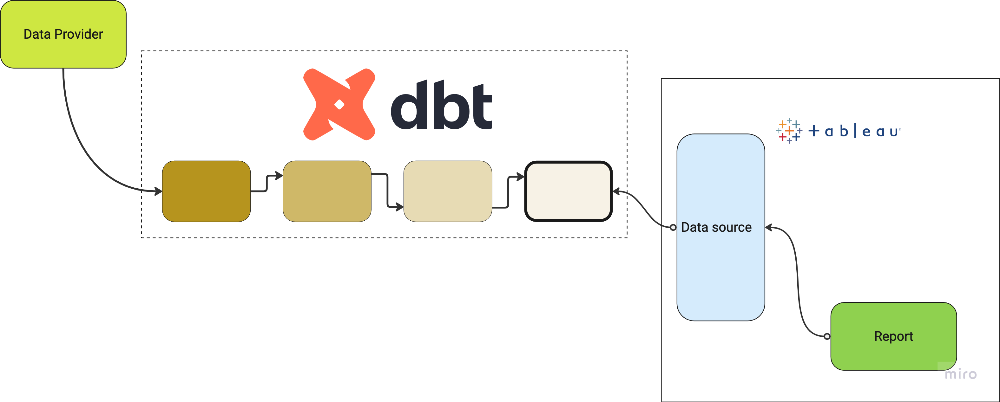

---

# When Business complains :scream:

## The figures are incorrect!

## Data could be late?

## Data could be wrong?

---

# Operability

* Data quality checks (e.g. dbt tests)
* Slack alerts on failures
* Not so business friendly :cry:

---

# From checks to **labels**

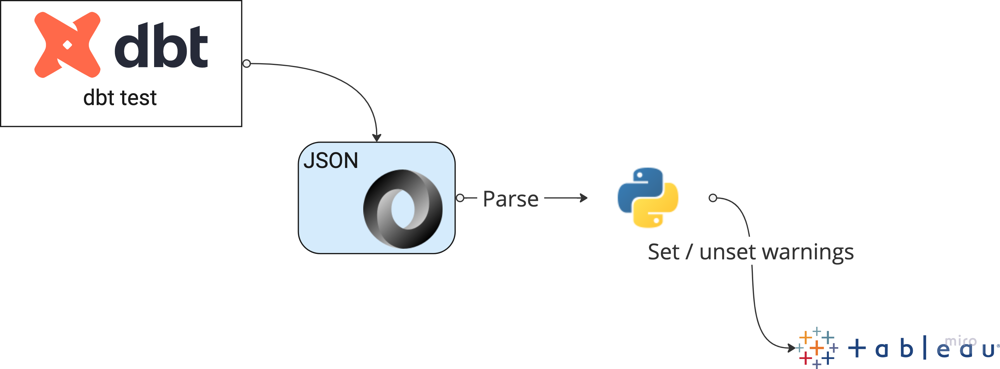

---

# Sample dbt code

```yaml
---
models:
  - name: tractor_sales
    columns:
      - name: created_at
        tests:
          - dbt_expectations.expect_row_values_to_have_recent_data:
              datepart: day
              interval: 1
              tags: ['tableau_recency']
```

#### See: [dbt expectations](https://github.com/calogica/dbt-expectations/tree/0.10.3/)

---

# Just enough Python :snake:

```Python
  table_item: TableItem = tableau_server.tables.get_by_id(luid)

  data_quality_warning: DQWItem = DQWItem(
      warning_type=DQWItem.WarningType.WARNING,
      message="This asset (Table/View) has stale data.",
      active=True,
      severe=True)

  tableau_server.tables.add_dqw(table_item, data_quality_warning)
```

---

# What does it look like?

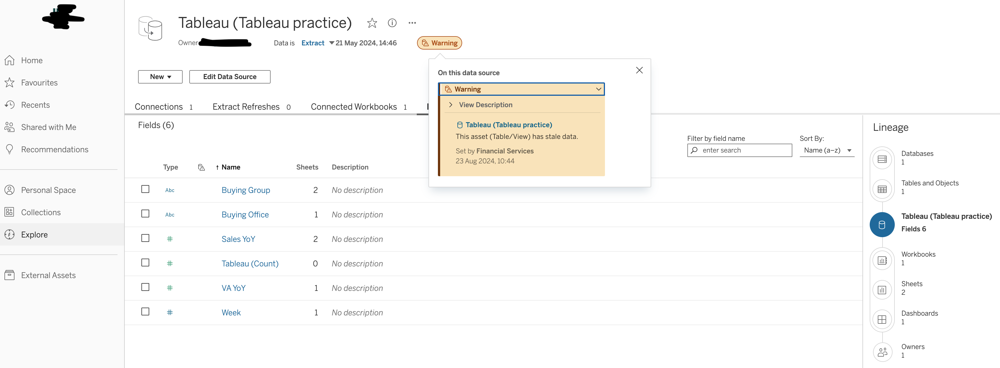

---

# Shift left: should you push this to production?
```SQL
SELECT applicationId AS application_id,
    datecreated as DATE_CREATED
from transactions;
```

---

# SQLFluff says NO!!!
```text
== [/Users/guillaumebelrose/Work/Presentations/dataconf24/dataconf-demo/resources/sql/lint.sql] FAIL                                           
L:   1 | P:   1 | LT09 | Select targets should be on a new line unless there is
                       | only one select target. [layout.select_targets]
L:   1 | P:   7 | LT02 | Expected line break and indent of 4 spaces before
                       | 'applicationId'. [layout.indent]
L:   1 | P:   8 | CP02 | Unquoted identifiers must be consistently upper case.
                       | [capitalisation.identifiers]
L:   2 | P:  17 | CP01 | Keywords must be consistently upper case.
                       | [capitalisation.keywords]
L:   7 | P:   1 | LT12 | Files must end with a single trailing newline.
                       | [layout.end_of_file]
All Finished 📜 🎉!
```

---

# Keeping reporting assets consistent

* Naming
  * Names | Descriptions
  * Tags
* Configuration
  * Caching
  * Database connection settings
* **Automated checks** over written guidelines

--- 

# Roll Your Own Linter

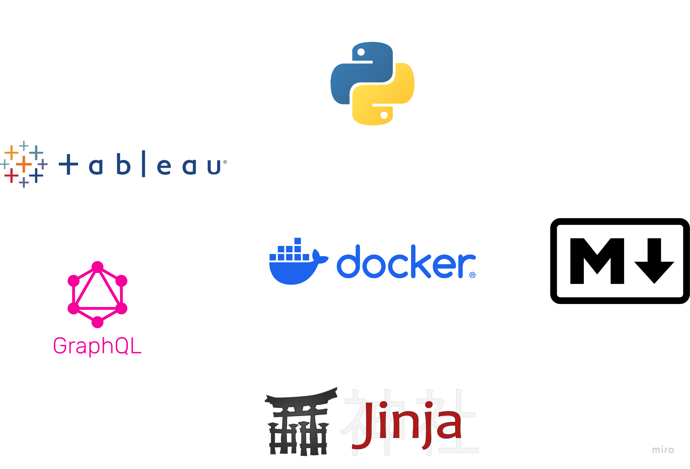

---

# Shift left: The effects of UI-driven work

### Time consuming to create | re-create

### Time consuming to verify

### Lack of audit trail

---

# Lack of release pipeline

### Less appreciation for segregated environments

### Dev work becomes productionised

### Self-serve vs dependable data

---

## Data Source As Code

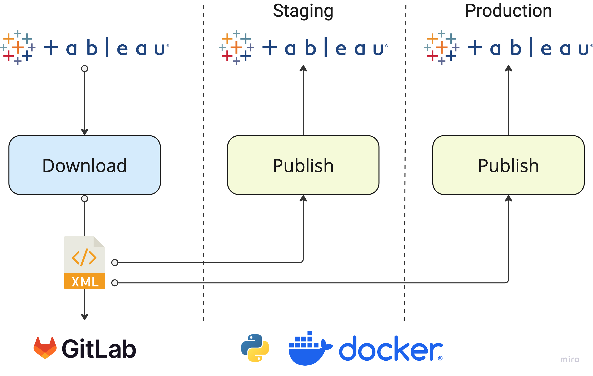

---

# What it enables

### Improved quality: dev -> qa -> prod

### Common deployment patterns for reporting and data pipelines

### Audit trail

---

# To recap

---

# Tales from production

* Applied this thinking to our domain
* Easier to adopt for green field projects
* Many areas are ripe for automation
* **Ways of working** just as crucial

---

# Thank you!

## To my awesome team 

## ...and the awesome audience :smile:

###### PS: don't ask me about PowerBI 